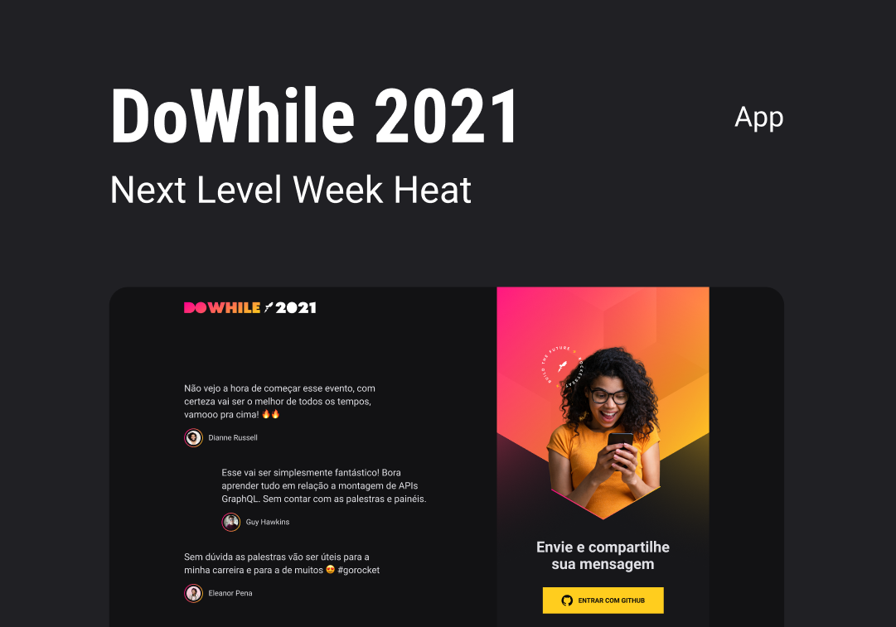

<h1 align="center">
  
</h1>

 

  

## 🚀 NLW Heat 2021 - DO WHILE

Esse projeto foi desenvolvido durante a semana do evento [DO WHILE 2021](https://nextlevelweek.com) da RocketSeat.

## App online para testar

App online: [https://nlwheat-2021.vercel.app](https://nlwheat-2021.vercel.app/). Front-end hospedado no [Vercel](https://vercel.com/), back-end hospedado no [Render](https://render.com) e banco de dados hospedado no [Supabase](https://supabase.com/).

## Projeto

O objetivo do evento é desenvolver uma aplicação completa, desde o back-end em Node.js, front-end para web em ReactJS,
front-end mobile em React Native e para finalizar, um microsserviço com Elixir. Este projeto consiste em um sistema para enviar e
visualizar mensagens em tempo real sobre o evento, para enviar uma mensagem o usuário deve estar logado com sua conta no Github.

## Layout

Você pode visualizar o layout do projeto através [desse link](https://www.figma.com/community/file/1031699316177416916). É necessário ter conta no [Figma](http://figma.com/) para acessá-lo.

## Stage 1 – Aula prática

Nessa aula criamos o backend da aplicação utilizando NodeJS. Nesse projeto iremos utilizar Typescript, que auxilia no aumento da produtividade em desenvolvimento; vamos utilizar o Prisma ORM, para trabalhar com banco de dados e Socket.IO para trabalhar comunicação em tempo real.

## Front-end

Você pode consumir essa aplicação usando [esse front-end para web (em ReactJS)](https://github.com/arianebrandao/nlw2021-heat-web) ou [esse para mobile (em React Native)](https://github.com/arianebrandao/nlw2021-heat-reactnative).

## Tecnologias

Esse projeto foi desenvolvido com as seguintes tecnologias:

- [NodeJS](https://nodejs.org)
- [TypeScript](https://www.typescriptlang.org/)
- [Prisma ORM](https://www.prisma.io)
- [Socket.IO](https://socket.io)
- [Axios](https://axios-http.com)

## Como executar

- Clone o repositório
- Instale as dependências com `yarn`
- Renomeie o arquivo `.env.example` para `.env` e adicione as variáveis necessárias, o `JWT_SECRET` pode ser gerado aleatoriamente. Para rodar com um banco de dados em localhost, altere o arquivo `prisma/schema.prisma`:
  
  `datasource db {
  provider = "postgresql"
  url      = env("DATABASE_URL")
}`

para:

`
datasource db {
  provider = "sqlite"
  url      = "file:./dev.db"
}
`

- Altere no arquivo `public/index.html`, o código: `const socket = io("https://nlw-heat.onrender.com/")` para o endereço onde 
irá rodar esse backend, se for localhost, altere para: `const socket = io("http://localhost:4000")`
- Importe as tabelas do SQLite com `yarn prisma migrate dev`
- Inicie o servidor com `yarn dev`

Agora você pode acessar [`localhost:4000`](http://localhost:4000) do seu navegador.

## Licença

Esse projeto está sob a licença MIT. Veja o arquivo [LICENSE](LICENSE.md) para mais detalhes.